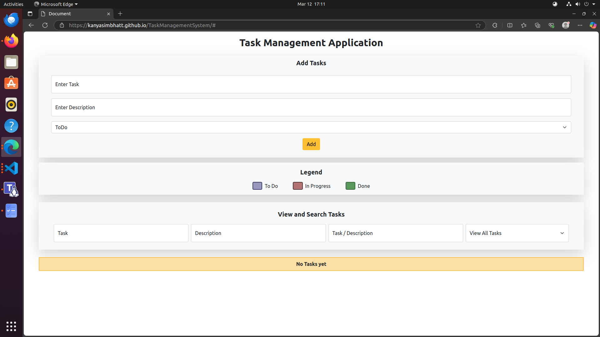
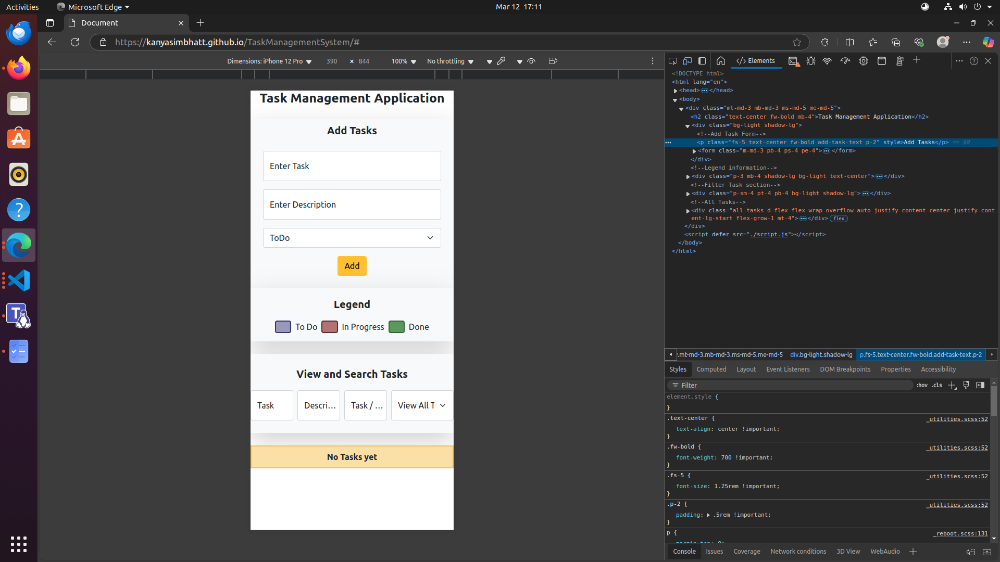

# Task Management System

## Overview : This is a simple Task Management System built using HTML, JavaScript, and Bootstrap. It allows users to create, manage, and track tasks efficiently.

#### Features :

- Add new tasks
- Edit existing tasks
- Delete tasks
- Responsive design using Bootstrap.
- Filter for the tasks according to the title, description, both.
- Status modification feature given from the task card and filter drop down.

#### Technologies Used : HTML , CSS (Bootstrap for styling) and JavaScript (for interactivity)

#### To explore, kindly visit: https://kanyasimbhatt.github.io/TaskManagementSystem/

#### ScreenShots for reference:

